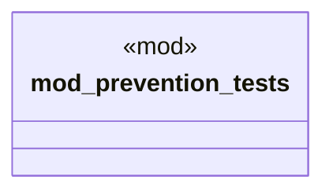

# `tests/prevention_integration_tests.rs`

Source SHA-256: `34705472e48ca679d524e6702606221cd4142ebf6204faee2f6213a077aff7d9`

## Dependencies

- None observed.

## Standing

- Structural parse: `ALIVE`
- Runtime behavior: `UNKNOWN`
