# `tests/proof/invariants.rs`

Source SHA-256: `20749bc0d75796794e17f67c614e125e5cc121a44673baaf699362e3b528c27a`

```mermaid
classDiagram
    class type_TestResult {
      <<type>>
    }
    class fn_setup_minimal_ggen_toml {
      <<fn>>
    }
    class fn_setup_minimal_ttl {
      <<fn>>
    }
    class fn_cli_01_sync_exits_zero_with_receipt {
      <<fn>>
    }
    class fn_cli_02_sync_locked_fails_without_packs_lock {
      <<fn>>
    }
    class fn_cli_03_init_creates_valid_ggen_toml {
      <<fn>>
    }
    class fn_cli_04_doctor_succeeds_on_valid_workspace {
      <<fn>>
    }
    class fn_cli_05_pack_add_fails_on_missing_pack {
      <<fn>>
    }
    class fn_pipe_01_sync_fails_on_invalid_ttl {
      <<fn>>
    }
    class fn_pipe_02_validate_succeeds_on_valid_ttl {
      <<fn>>
    }
    class fn_rcpt_01_sync_writes_receipt_directory {
      <<fn>>
    }
    class fn_rcpt_02_receipt_has_non_empty_signature {
      <<fn>>
    }
    class fn_man_01_ggen_toml_contains_project_section {
      <<fn>>
    }
    class fn_graph_01_deterministic_validate_output {
      <<fn>>
    }
```

## Dependencies

- `assert_cmd::Command`
- `std::fs`
- `tempfile::TempDir`

## Standing

- Structural parse: `ALIVE`
- Runtime behavior: `UNKNOWN`
