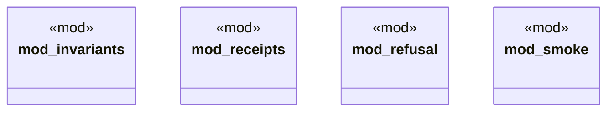

# `tests/proof/mod.rs`

Source SHA-256: `0396bfe00ae3275cead324fbc2f7936f4227a965f65d8d532c35865d0f81a3e9`

## Dependencies

- None observed.

## Standing

- Structural parse: `ALIVE`
- Runtime behavior: `UNKNOWN`
