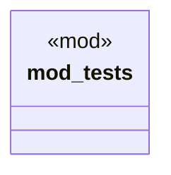

# `tests/proof/receipts.rs`

Source SHA-256: `bcb614012d33d389b1ded6a6f8e6aca5305006696f59e5b2eb0421a14067249d`

## Dependencies

- `assert_cmd::Command`
- `sha2::{Digest, Sha256}`
- `std::fs`
- `tempfile::TempDir`

## Standing

- Structural parse: `ALIVE`
- Runtime behavior: `UNKNOWN`
