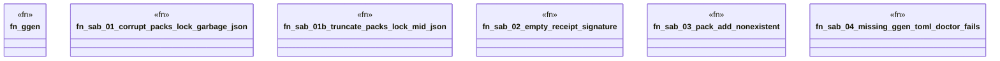

# `tests/proof/refusal.rs`

Source SHA-256: `bc589762338baa5f5bda06206043b403b20ea72a987c63f48dab6f7a5c384857`

## Dependencies

- `assert_cmd::Command`
- `predicates::prelude::*`
- `std::fs`
- `tempfile::TempDir`

## Standing

- Structural parse: `ALIVE`
- Runtime behavior: `UNKNOWN`
