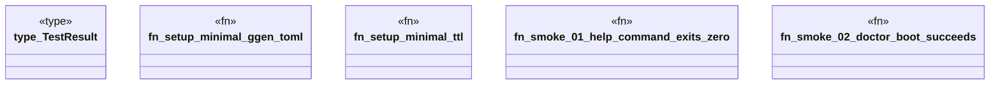

# `tests/proof/smoke.rs`

Source SHA-256: `1deb9fe937e28616217bbd8faebaaeb54969f191e82e1c197e34d36051e18310`

## Dependencies

- `assert_cmd::Command`
- `std::fs`
- `tempfile::TempDir`

## Standing

- Structural parse: `ALIVE`
- Runtime behavior: `UNKNOWN`
