# `tests/security/comprehensive_suite.rs`

Source SHA-256: `4d02090e8bfcd3312c6df3d13a41761754de7b4d2a17c31773f174f6eae17a44`

```mermaid
classDiagram
    class mod_owasp_top_10 {
      <<mod>>
    }
    class mod_load_tests {
      <<mod>>
    }
    class mod_penetration_tests {
      <<mod>>
    }
    class fn_setup_log_capture {
      <<fn>>
    }
    class struct_LogCapture {
      <<struct>>
      +"logs: Vec~String~"
    }
    class enum_LoginError {
      <<enum>>
    }
    class struct_TestSession {
      <<struct>>
      +"id: String"
      +"csrf_token: String"
    }
    class enum_SessionError {
      <<enum>>
    }
    class fn_compute_sha256 {
      <<fn>>
    }
    class fn_setup_audit_log_capture {
      <<fn>>
    }
    class struct_AuditLogCapture {
      <<struct>>
      +"events: Vec~AuditEvent~"
    }
    class struct_AuditEvent {
      <<struct>>
      +"event_type: String"
      +"timestamp: Option~std::time::SystemTime~"
      +"user_context: Option~String~"
      +"ip_address: Option~String~"
    }
    class struct_TestServer {
      <<struct>>
    }
    class struct_TestResponse {
      <<struct>>
      +"headers: std::collections::HashMap~String"
    }
    class enum_CsrfError {
      <<enum>>
    }
    class struct_AuditResult {
      <<struct>>
      +"vulnerabilities: Vec~String~"
    }
    note "AuditLogCapture"
    note "LogCapture"
    note "TestServer"
    note "std::fmt::Display for LoginError"
```

## Dependencies

- `bcrypt::{hash, DEFAULT_COST}`
- `sha2::{Digest, Sha256}`
- `std::time::Duration`
- `super::*`
- `tokio::time::timeout`

## Standing

- Structural parse: `ALIVE`
- Runtime behavior: `UNKNOWN`
