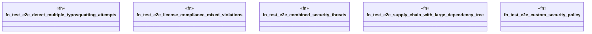

# `tests/security/e2e_vulnerability_tests.rs`

Source SHA-256: `90c0142b81d8566b22f438b15501e2e627070c0926be4dd96f85d577cb5689de`

## Dependencies

- `ggen_core::utils::supply_chain::{ check_license_compliance, detect_typosquatting, Dependency, SupplyChainConfig, }`
- `std::collections::HashMap`

## Standing

- Structural parse: `ALIVE`
- Runtime behavior: `UNKNOWN`
