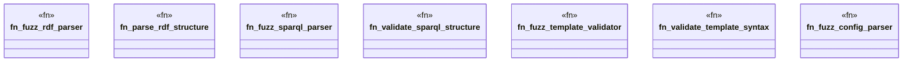

# `tests/security/fuzzing_targets.rs`

Source SHA-256: `7c8498eb044f43a45bd0acf29e22c595f5b676a170d37d0a30ed7c48c16c05a2`

## Dependencies

- `libfuzzer_sys::fuzz_target`
- `std::collections::HashMap`
- `super::*`

## Standing

- Structural parse: `ALIVE`
- Runtime behavior: `UNKNOWN`
