# `tests/security/input_validation_tests.rs`

Source SHA-256: `4cfe205ac4cf4459ac5900b41a705ad71424e513fd32cab879b1afbbbc450734`

```mermaid
classDiagram
    class struct_InputValidationFixture {
      <<struct>>
      +"workspace: TempDir"
    }
    class fn_test_malformed_template_rejected {
      <<fn>>
    }
    class fn_test_template_with_code_execution_blocked {
      <<fn>>
    }
    class fn_test_oversized_template_rejected {
      <<fn>>
    }
    class fn_test_invalid_rdf_syntax_rejected {
      <<fn>>
    }
    class fn_test_rdf_with_external_entities_blocked {
      <<fn>>
    }
    class fn_test_oversized_rdf_file_rejected {
      <<fn>>
    }
    class fn_test_invalid_toml_config_rejected {
      <<fn>>
    }
    class fn_test_config_with_dangerous_values_rejected {
      <<fn>>
    }
    class fn_test_negative_numeric_arguments_rejected {
      <<fn>>
    }
    class fn_test_extremely_long_argument_rejected {
      <<fn>>
    }
    class fn_test_special_characters_in_arguments_handled {
      <<fn>>
    }
    class fn_test_malicious_env_vars_ignored {
      <<fn>>
    }
    class fn_test_oversized_env_var_values_rejected {
      <<fn>>
    }
    class fn_test_max_integer_values_handled {
      <<fn>>
    }
    class fn_test_empty_required_arguments_rejected {
      <<fn>>
    }
    class fn_test_legitimate_inputs_succeed {
      <<fn>>
    }
    note "InputValidationFixture"
```

## Dependencies

- `assert_cmd::Command`
- `predicates::prelude::*`
- `std::fs`
- `tempfile::TempDir`

## Standing

- Structural parse: `ALIVE`
- Runtime behavior: `UNKNOWN`
