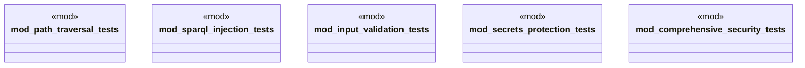

# `tests/security/mod.rs`

Source SHA-256: `c1f1101267dd846ba4dc7205b69403dc76171fbef8829d11d1cec7fb849d7afb`

## Dependencies

- None observed.

## Standing

- Structural parse: `ALIVE`
- Runtime behavior: `UNKNOWN`
