# `tests/security/path_traversal_tests.rs`

Source SHA-256: `0afa030b3e70002f5701b5d7791f410609c12840ceecaf52eb149970fb8d5b61`

```mermaid
classDiagram
    class struct_PathTraversalFixture {
      <<struct>>
      +"workspace: TempDir"
      +"templates_dir: PathBuf"
      +"output_dir: PathBuf"
      +"secrets_dir: TempDir"
    }
    class fn_test_template_path_traversal_blocked {
      <<fn>>
    }
    class fn_test_symlink_attack_prevention {
      <<fn>>
    }
    class fn_test_null_byte_injection_blocked {
      <<fn>>
    }
    class fn_test_unicode_normalization_attacks_blocked {
      <<fn>>
    }
    class fn_test_rdf_file_path_traversal_blocked {
      <<fn>>
    }
    class fn_test_output_path_traversal_blocked {
      <<fn>>
    }
    class fn_test_error_messages_dont_leak_system_paths {
      <<fn>>
    }
    class fn_test_legitimate_paths_work {
      <<fn>>
    }
    note "PathTraversalFixture"
```

## Dependencies

- `assert_cmd::Command`
- `predicates::prelude::*`
- `std::fs`
- `std::os::unix::fs::symlink`
- `std::path::PathBuf`
- `tempfile::TempDir`

## Standing

- Structural parse: `ALIVE`
- Runtime behavior: `UNKNOWN`
