# `tests/security/rate_limit_integration_tests.rs`

Source SHA-256: `3a8ed5473a482bd3f0f7a69e996f0f0390803f0fd1bf62973dc42cb1bf0a0611`

```mermaid
classDiagram
    class struct_RateLimitFixture {
      <<struct>>
      +"_container: testcontainers::Container~'static"
      +"redis_url: String"
      +"api_base_url: String"
      +"client: Client"
    }
    class fn_test_concurrent_requests_hit_rate_limit {
      <<fn>>
    }
    class fn_test_different_ips_independent_limits {
      <<fn>>
    }
    class fn_test_api_key_rate_limiting {
      <<fn>>
    }
    class fn_test_burst_requests_handled {
      <<fn>>
    }
    class fn_test_rate_limit_recovery_after_window {
      <<fn>>
    }
    class fn_test_distributed_rate_limiting_shared_redis {
      <<fn>>
    }
    class fn_test_rate_limit_headers_present {
      <<fn>>
    }
    note "RateLimitFixture"
```

## Dependencies

- `reqwest::blocking::Client`
- `std::sync::Arc`
- `std::sync::atomic::{AtomicUsize, Ordering}`
- `std::thread`
- `std::time::Duration`
- `testcontainers::{clients::Cli, RunnableImage}`
- `testcontainers_modules::redis::Redis`

## Standing

- Structural parse: `ALIVE`
- Runtime behavior: `UNKNOWN`
