# `tests/security/secrets_protection_tests.rs`

Source SHA-256: `625d377fa9e762bb3e51dd1e91a55bbb077ee8d6ac2991bf9cc6b598b08c5746`

```mermaid
classDiagram
    class struct_SecretsFixture {
      <<struct>>
      +"workspace: TempDir"
      +"api_key: String"
      +"password: String"
      +"secret_token: String"
    }
    class fn_test_api_keys_not_logged {
      <<fn>>
    }
    class fn_test_passwords_not_logged {
      <<fn>>
    }
    class fn_test_tokens_not_logged {
      <<fn>>
    }
    class fn_test_error_messages_redact_credentials {
      <<fn>>
    }
    class fn_test_connection_string_errors_redacted {
      <<fn>>
    }
    class fn_test_stack_traces_sanitized {
      <<fn>>
    }
    class fn_test_config_values_not_in_output {
      <<fn>>
    }
    class fn_test_env_vars_not_exposed_in_errors {
      <<fn>>
    }
    class fn_test_env_var_dump_redacts_secrets {
      <<fn>>
    }
    class fn_test_common_secret_patterns_redacted {
      <<fn>>
    }
    class fn_test_public_values_not_redacted {
      <<fn>>
    }
    note "SecretsFixture"
```

## Dependencies

- `assert_cmd::Command`
- `predicates::prelude::*`
- `std::fs`
- `tempfile::TempDir`

## Standing

- Structural parse: `ALIVE`
- Runtime behavior: `UNKNOWN`
