# `tests/security/sparql_injection_tests.rs`

Source SHA-256: `7452dd4e3887b5fc93ba5c45faa94a5b521e738755b0b009f6cbd2255426ba3b`

```mermaid
classDiagram
    class struct_SparqlInjectionFixture {
      <<struct>>
      +"workspace: TempDir"
      +"rdf_file: std::path::PathBuf"
      +"template_file: std::path::PathBuf"
    }
    class fn_test_union_based_injection_blocked {
      <<fn>>
    }
    class fn_test_comment_injection_blocked {
      <<fn>>
    }
    class fn_test_filter_bypass_injection_blocked {
      <<fn>>
    }
    class fn_test_graph_traversal_injection_blocked {
      <<fn>>
    }
    class fn_test_property_path_injection_blocked {
      <<fn>>
    }
    class fn_test_service_injection_blocked {
      <<fn>>
    }
    class fn_test_blind_injection_timing_attack {
      <<fn>>
    }
    class fn_test_no_data_exfiltration_via_error_messages {
      <<fn>>
    }
    class fn_test_parameterized_queries_safe {
      <<fn>>
    }
    class fn_test_legitimate_queries_succeed {
      <<fn>>
    }
    note "SparqlInjectionFixture"
```

## Dependencies

- `assert_cmd::Command`
- `oxigraph::io::RdfFormat`
- `oxigraph::store::Store`
- `predicates::prelude::*`
- `std::fs`
- `tempfile::TempDir`

## Standing

- Structural parse: `ALIVE`
- Runtime behavior: `UNKNOWN`
