# `tests/security/supply_chain_tests.rs`

Source SHA-256: `5c097d561ab3ef6c7cc9710e590e285150d6e599ae1d824975f0175aa60298d4`

```mermaid
classDiagram
    class fn_test_levenshtein_distance_zero_for_identical_strings {
      <<fn>>
    }
    class fn_test_levenshtein_distance_one_for_single_char_difference {
      <<fn>>
    }
    class fn_test_levenshtein_distance_handles_insertion {
      <<fn>>
    }
    class fn_test_levenshtein_distance_handles_deletion {
      <<fn>>
    }
    class fn_test_typosquatting_detection_finds_suffix_pattern {
      <<fn>>
    }
    class fn_test_typosquatting_detection_finds_prefix_pattern {
      <<fn>>
    }
    class fn_test_typosquatting_detection_finds_similar_names {
      <<fn>>
    }
    class fn_test_typosquatting_detection_ignores_popular_crates {
      <<fn>>
    }
    class fn_test_license_compliance_allows_mit {
      <<fn>>
    }
    class fn_test_license_compliance_denies_gpl3 {
      <<fn>>
    }
    class fn_test_license_compliance_tracks_distribution {
      <<fn>>
    }
    class fn_test_checksum_verification_succeeds_on_match {
      <<fn>>
    }
    class fn_test_checksum_verification_fails_on_mismatch {
      <<fn>>
    }
    class fn_test_checksum_verification_errors_on_missing_checksum {
      <<fn>>
    }
```

## Dependencies

- `ggen_core::utils::supply_chain::{ check_license_compliance, detect_typosquatting, levenshtein_distance, verify_checksum, Dependency, SupplyChainConfig, }`

## Standing

- Structural parse: `ALIVE`
- Runtime behavior: `UNKNOWN`
