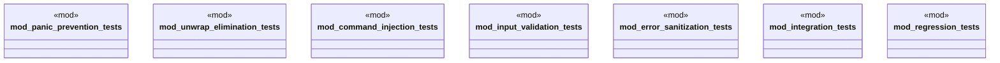

# `tests/security/week4_security_hardening_tests.rs`

Source SHA-256: `c1e9cb21b567c9253fe1e46ea1566411a32b7981516e78def22da9b2c17a8974`

## Dependencies

- `ggen_core::security::command::{SafeCommand, CommandExecutor}`
- `ggen_core::security::error::ErrorSanitizer`
- `ggen_core::security::error::SanitizedError`
- `ggen_core::security::validation::{PathValidator, EnvVarValidator, InputValidator}`
- `ggen_core::template_cache::TemplateCache`
- `std::path::Path`
- `super::*`

## Standing

- Structural parse: `ALIVE`
- Runtime behavior: `UNKNOWN`
