# `tests/templates/chicago_tdd_template.rs`

Source SHA-256: `b9ac483cc0e782e3448da547b5e17184eac8e4baa5fbd6e15efbb06fd8729d6c`

```mermaid
classDiagram
    class fn_when_processing_valid_input_should_return_success_and_update_state {
      <<fn>>
    }
    class fn_when_processing_invalid_input_should_return_error_without_state_change {
      <<fn>>
    }
    class mod_property_tests {
      <<mod>>
    }
    class fn_wrong_london_style_test_with_mocks {
      <<fn>>
    }
    class fn_wrong_meaningless_test {
      <<fn>>
    }
    class fn_wrong_implementation_detail_test {
      <<fn>>
    }
    class fn_create_valid_input {
      <<fn>>
    }
    class fn_create_invalid_input {
      <<fn>>
    }
    class struct_RealSystem {
      <<struct>>
    }
    class struct_Input {
      <<struct>>
    }
    class struct_ProcessResult {
      <<struct>>
      +"status: ProcessStatus"
    }
    class enum_ProcessStatus {
      <<enum>>
    }
    class struct_ProcessError {
      <<struct>>
      +"kind: ErrorKind"
    }
    class enum_ErrorKind {
      <<enum>>
    }
    class struct_InMemoryDatabase {
      <<struct>>
    }
    class struct_RealCache {
      <<struct>>
    }
    note "Clone for Input"
    note "InMemoryDatabase"
    note "Input"
    note "PartialEq for ProcessResult"
    note "ProcessError"
    note "ProcessResult"
    note "RealCache"
    note "RealSystem"
```

## Dependencies

- `proptest::prelude::*`

## Standing

- Structural parse: `ALIVE`
- Runtime behavior: `UNKNOWN`
