# `tests/test_ggen_cli.rs`

Source SHA-256: `b43cf26eddb0ffb0078b8feb97eb65a0e390d7c31d23d78a084aa7316492ad0c`

```mermaid
classDiagram
    class struct_TestResult {
      <<struct>>
      +"exit_code: i32"
      +"stdout: String"
      +"stderr: String"
      +"duration_ms: u128"
      +"command: String"
    }
    class fn_find_ggen_binary {
      <<fn>>
    }
    class fn_run_ggen_command {
      <<fn>>
    }
    class fn_test_basic_commands {
      <<fn>>
    }
    class fn_test_project_commands {
      <<fn>>
    }
    class fn_test_template_commands {
      <<fn>>
    }
    class fn_test_graph_commands {
      <<fn>>
    }
    class fn_test_market_commands {
      <<fn>>
    }
    class fn_test_ai_commands {
      <<fn>>
    }
    class fn_test_ggen_workflow {
      <<fn>>
    }
    class fn_test_binary_detection {
      <<fn>>
    }
    class fn_main {
      <<fn>>
    }
    class mod_tests {
      <<mod>>
    }
    note "TestResult"
```

## Dependencies

- `std::path::PathBuf`
- `std::process::Command`
- `std::time::Instant`
- `super::*`

## Standing

- Structural parse: `ALIVE`
- Runtime behavior: `UNKNOWN`
