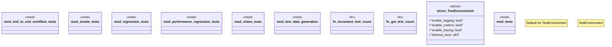

# `tests/tps/mod.rs`

Source SHA-256: `ea0e9a7a118ab84175f36639ac0210d259b7e0a57cac7f6fc0c4409aba5e5f19`

## Dependencies

- `std::sync::Arc`
- `std::sync::atomic::{AtomicUsize, Ordering}`
- `super::*`
- `test_data_generation::{ AllTestDataProvider, CrossPrincipleScenario, CrossPrincipleScenarioBuilder, DeploymentTestCase, DeploymentTestDataBuilder, FailureScenario, FailureScenarioBuilder, LoadDataPoint, LoadProfileBuilder, PaymentTestCase, PaymentTestDataBuilder, QueueWorkloadBuilder, WorkItem, }`

## Standing

- Structural parse: `ALIVE`
- Runtime behavior: `UNKNOWN`
