# `tests/tps/regression_tests.rs`

Source SHA-256: `83ebb52ffb0eef1c29065bf17e0cb17734718a3d6655706b186176834e2a9faf`

```mermaid
classDiagram
    class struct_ProcessingRequest {
      <<struct>>
      +"amount: f64"
      +"customer: String"
    }
    class struct_PaymentResult {
      <<struct>>
      +"status: String"
      +"transaction_id: String"
      +"amount: f64"
    }
    class struct_PaymentProcessingSystem {
      <<struct>>
    }
    class struct_AndonSignalData {
      <<struct>>
      +"level: String"
      +"message: String"
      +"timestamp: String"
    }
    class struct_AndonSignalTest {
      <<struct>>
    }
    class struct_DeploymentConfig {
      <<struct>>
      +"service: String"
      +"replicas: usize"
    }
    class struct_DeploymentConfigTest {
      <<struct>>
    }
    class struct_ErrorDetails {
      <<struct>>
      +"code: String"
      +"message: String"
    }
    class struct_ErrorHandlingTest {
      <<struct>>
    }
    class struct_KanbanStateSnapshot {
      <<struct>>
      +"queue_depth: usize"
      +"processing: usize"
    }
    class struct_KanbanStateTest {
      <<struct>>
      +"state: Arc~RwLock~KanbanStateSnapshot~~"
    }
    class struct_MetricsSnapshot {
      <<struct>>
      +"events: std::collections::HashMap~String"
    }
    class struct_MetricsTest {
      <<struct>>
      +"metrics: Arc~RwLock~std::collections::HashMap~String"
    }
    class struct_TraceData {
      <<struct>>
      +"operation: String"
      +"span_count: usize"
    }
    class struct_TraceTest {
      <<struct>>
    }
    class struct_JidokaResponse {
      <<struct>>
      +"status: String"
      +"reason: String"
    }
    class struct_JidokaFailureTest {
      <<struct>>
    }
    class struct_CrossPrincipleResult {
      <<struct>>
      +"jidoka_engaged: bool"
      +"kanban_blocked: bool"
      +"andon_signal_sent: bool"
    }
    class struct_CrossPrincipleTest {
      <<struct>>
    }
    class struct_AlertEscalation {
      <<struct>>
      +"step: usize"
      +"level: String"
    }
    class struct_AlertEscalationTest {
      <<struct>>
    }
    note "AlertEscalationTest"
    note "AndonSignalTest"
    note "CrossPrincipleTest"
    note "DeploymentConfigTest"
    note "ErrorHandlingTest"
    note "JidokaFailureTest"
    note "KanbanStateTest"
    note "MetricsTest"
    note "PaymentProcessingSystem"
    note "TraceTest"
```

## Dependencies

- `chrono`
- `serde`
- `std::collections`
- `std::sync::Arc`
- `tokio::sync::RwLock`
- `uuid`

## Standing

- Structural parse: `ALIVE`
- Runtime behavior: `UNKNOWN`
