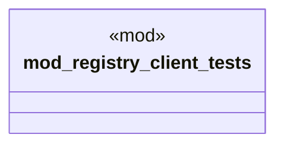

# `tests/transport/mod.rs`

Source SHA-256: `35427a9df814e86bcce1ae90fa0ff892e967965e68c347cb435c302021d8b14f`

## Dependencies

- None observed.

## Standing

- Structural parse: `ALIVE`
- Runtime behavior: `UNKNOWN`
