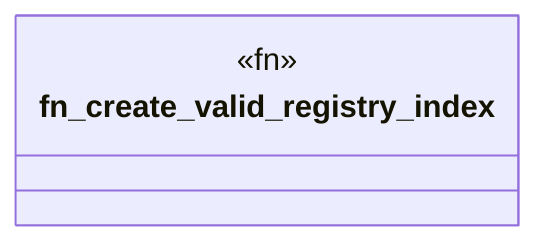

# `tests/transport/registry_client_tests.rs`

Source SHA-256: `77d212c903184537d712b39c1f8eceb5eae8670237001867c379aba5d7ab6b96`

## Dependencies

- `ggen_core::registry::RegistryClient`
- `reqwest::Url`
- `std::time::Duration`

## Standing

- Structural parse: `ALIVE`
- Runtime behavior: `UNKNOWN`
