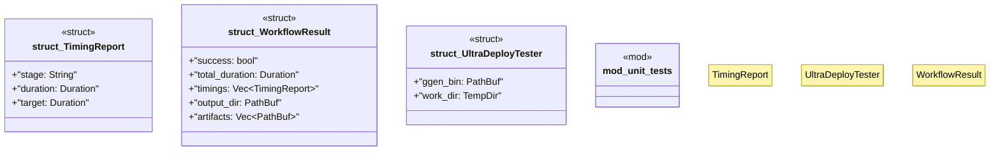

# `tests/ultra_deploy_test.rs`

Source SHA-256: `4350823a8f7fdc2f19c7d2f5690418f1fff010063767fb1aeee3a71b7b7a0f93`

## Dependencies

- `anyhow::Result`
- `assert_cmd::Command`
- `serial_test::serial`
- `std::path::{Path, PathBuf}`
- `std::time::{Duration, Instant}`
- `super::*`
- `tempfile::TempDir`

## Standing

- Structural parse: `ALIVE`
- Runtime behavior: `UNKNOWN`
