# `tests/unit/marketplace_critical_tests.rs`

Source SHA-256: `a42322984ac4af45fc68ff92b11308aa794fffef98ec2099dab258b8f30be5c4`

```mermaid
classDiagram
    class fn_test_search_single_keyword_returns_matches {
      <<fn>>
    }
    class fn_test_search_empty_index_returns_no_results {
      <<fn>>
    }
    class fn_test_search_with_version_filter {
      <<fn>>
    }
    class fn_test_install_creates_valid_lockfile {
      <<fn>>
    }
    class fn_test_install_force_overwrite_updates_version {
      <<fn>>
    }
    class fn_test_install_resolves_dependencies_correctly {
      <<fn>>
    }
    class fn_test_publish_accepts_valid_semantic_version {
      <<fn>>
    }
    class fn_test_publish_rejects_invalid_version_format {
      <<fn>>
    }
    class fn_test_publish_prevents_version_conflicts {
      <<fn>>
    }
```

## Dependencies

- `ggen_core::utils::error::Result`
- `std::fs`
- `std::path::PathBuf`
- `tempfile::TempDir`

## Standing

- Structural parse: `ALIVE`
- Runtime behavior: `UNKNOWN`
