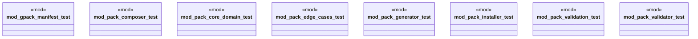

# `tests/unit/packs/mod.rs`

Source SHA-256: `2186a027174b88a5c13045a59f76ede055ebf387f7c12740c8c152dba59f462f`

## Dependencies

- None observed.

## Standing

- Structural parse: `ALIVE`
- Runtime behavior: `UNKNOWN`
