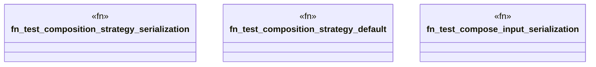

# `tests/unit/packs/pack_composer_test.rs`

Source SHA-256: `a0e1b039daf88e11e41a7a10fa675375fb180892c050b94941981f6295f44e55`

## Dependencies

- `ggen_marketplace::packs_registry::compose::{compose_packs, ComposePacksInput}`
- `ggen_marketplace::packs_registry::types::{ CompositionStrategy, Pack, PackDependency, PackMetadata, }`
- `std::collections::HashMap`
- `std::path::PathBuf`

## Standing

- Structural parse: `ALIVE`
- Runtime behavior: `UNKNOWN`
