# `tests/unit/packs/pack_core_domain_test.rs`

Source SHA-256: `5d540292bac2efafe4d86ceec63a8c09fc8aaa2d7836e0479b5234b3c683e7a8`

```mermaid
classDiagram
    class fn_test_list_packs_returns_results {
      <<fn>>
    }
    class fn_test_list_packs_filters_by_category {
      <<fn>>
    }
    class fn_test_show_pack_retrieves_details {
      <<fn>>
    }
    class fn_test_load_pack_metadata_validates_structure {
      <<fn>>
    }
    class fn_test_pack_type_serialization {
      <<fn>>
    }
    class fn_test_pack_with_optional_fields {
      <<fn>>
    }
    class fn_test_pack_dependency_structure {
      <<fn>>
    }
    class fn_test_pack_template_structure {
      <<fn>>
    }
    class fn_test_list_packs_empty_category {
      <<fn>>
    }
    class fn_test_pack_metadata_defaults {
      <<fn>>
    }
```

## Dependencies

- `ggen_marketplace::packs_registry::metadata::{list_packs, load_pack_metadata, show_pack}`
- `ggen_marketplace::packs_registry::types::PackMetadata`
- `ggen_marketplace::packs_registry::types::{Pack, PackDependency, PackTemplate}`
- `std::collections::HashMap`

## Standing

- Structural parse: `ALIVE`
- Runtime behavior: `UNKNOWN`
