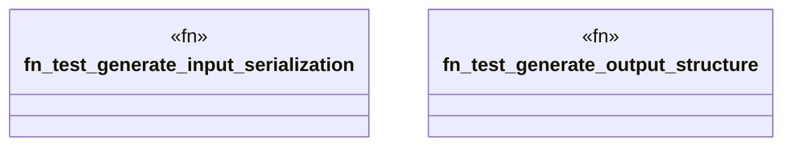

# `tests/unit/packs/pack_generator_test.rs`

Source SHA-256: `587ff5c44ce013e8d7afbd0417a9ddc3d0ce04c925cadeefcece6eef190ce0cb`

## Dependencies

- `ggen_marketplace::packs_registry::generator::{generate_from_pack, GenerateInput}`
- `std::collections::BTreeMap`
- `std::path::PathBuf`

## Standing

- Structural parse: `ALIVE`
- Runtime behavior: `UNKNOWN`
