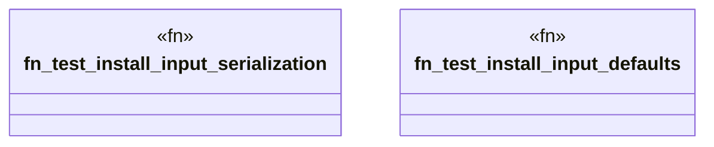

# `tests/unit/packs/pack_installer_test.rs`

Source SHA-256: `61edacebc7d63f6cc2b136a6ebb2e6338b967733bb398c2fe1039c6c82b54cee`

## Dependencies

- `ggen_marketplace::marketplace::install::{install_pack_by_id, InstallByIdInput}`
- `std::path::PathBuf`

## Standing

- Structural parse: `ALIVE`
- Runtime behavior: `UNKNOWN`
