# `tests/unit/packs/pack_validation_test.rs`

Source SHA-256: `1c6982ae9b8b13d8429386377cd56923d3e947d98ae083ab627e887aae6cd5d3`

```mermaid
classDiagram
    class fn_test_validate_pack_id_format {
      <<fn>>
    }
    class fn_test_validate_version_semver {
      <<fn>>
    }
    class fn_test_validate_license_spdx {
      <<fn>>
    }
    class fn_test_validate_ggen_compat_version_req {
      <<fn>>
    }
    class fn_test_validate_metadata_required_fields {
      <<fn>>
    }
    class fn_test_validate_dependency_versions {
      <<fn>>
    }
    class fn_test_detect_no_self_dependency {
      <<fn>>
    }
    class fn_test_validate_rdf_base_uri {
      <<fn>>
    }
    class fn_test_validate_rdf_prefixes {
      <<fn>>
    }
    class fn_test_validate_inline_rdf_syntax {
      <<fn>>
    }
    class fn_test_validate_glob_patterns {
      <<fn>>
    }
    class fn_test_validate_dependency_version_constraints {
      <<fn>>
    }
    class fn_test_validate_query_aliases_reference_patterns {
      <<fn>>
    }
    class fn_test_validate_complete_pack {
      <<fn>>
    }
    class fn_test_detect_invalid_pack_structure {
      <<fn>>
    }
    class fn_is_valid_pack_id {
      <<fn>>
    }
    class fn_is_valid_license {
      <<fn>>
    }
    class fn_is_valid_glob_pattern {
      <<fn>>
    }
```

## Dependencies

- `ggen_core::gpack::{GpackManifest, GpackMetadata}`
- `std::collections::BTreeMap`
- `tempfile::TempDir`

## Standing

- Structural parse: `ALIVE`
- Runtime behavior: `UNKNOWN`
