# `tests/unit/packs/pack_validator_test.rs`

Source SHA-256: `f08b371201ae8ceefe9c9b77b0ab1302411b546288184f7697fa601c8e29e00a`

```mermaid
classDiagram
    class fn_test_validate_pack_structure {
      <<fn>>
    }
    class fn_test_validate_nonexistent_pack_fails {
      <<fn>>
    }
    class fn_test_validate_pack_has_checks {
      <<fn>>
    }
    class fn_test_validate_pack_errors_and_warnings {
      <<fn>>
    }
    class fn_test_score_pack_returns_dimensions {
      <<fn>>
    }
    class fn_test_score_pack_production_ready_affects_score {
      <<fn>>
    }
    class fn_test_score_pack_with_metadata {
      <<fn>>
    }
    class fn_test_score_maturity_levels {
      <<fn>>
    }
    class fn_test_validate_pack_with_dependencies {
      <<fn>>
    }
    class fn_test_validation_result_serialization {
      <<fn>>
    }
    class fn_test_pack_score_serialization {
      <<fn>>
    }
```

## Dependencies

- `ggen_marketplace::packs_registry::metadata::show_pack`
- `ggen_marketplace::packs_registry::score::PackScore`
- `ggen_marketplace::packs_registry::score::score_pack`
- `ggen_marketplace::packs_registry::validate::ValidationResult`
- `ggen_marketplace::packs_registry::validate::validate_pack`

## Standing

- Structural parse: `ALIVE`
- Runtime behavior: `UNKNOWN`
