# `tests/unit/template_critical_tests.rs`

Source SHA-256: `6e2f4743461f59843f5bd4d7bed92664b9bb3e0f83bf254af92daa4e410387b3`

```mermaid
classDiagram
    class fn_test_template_basic_render {
      <<fn>>
    }
    class fn_test_template_missing_variable_handling {
      <<fn>>
    }
    class fn_test_template_loop_rendering {
      <<fn>>
    }
    class fn_test_template_conditional_rendering {
      <<fn>>
    }
    class fn_test_template_nested_loops {
      <<fn>>
    }
    class fn_test_template_sparql_query_execution {
      <<fn>>
    }
    class fn_test_template_sparql_empty_results {
      <<fn>>
    }
    class fn_test_template_respects_existing_files {
      <<fn>>
    }
    class fn_test_template_force_overwrite {
      <<fn>>
    }
    class fn_test_template_creates_directories {
      <<fn>>
    }
    class fn_test_template_filters {
      <<fn>>
    }
    class fn_test_template_multiple_outputs {
      <<fn>>
    }
```

## Dependencies

- `std::fs`
- `std::path::PathBuf`
- `tempfile::TempDir`

## Standing

- Structural parse: `ALIVE`
- Runtime behavior: `UNKNOWN`
