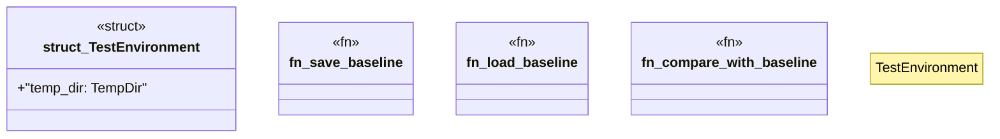

# `tests/v3-refactor/lib.rs`

Source SHA-256: `720271a0bc8f25bf9d750445d41bfd1978f131237bd9d8a7cadebb1ced756d19`

## Dependencies

- `std::fs`
- `std::path::{Path, PathBuf}`
- `tempfile::TempDir`

## Standing

- Structural parse: `ALIVE`
- Runtime behavior: `UNKNOWN`
