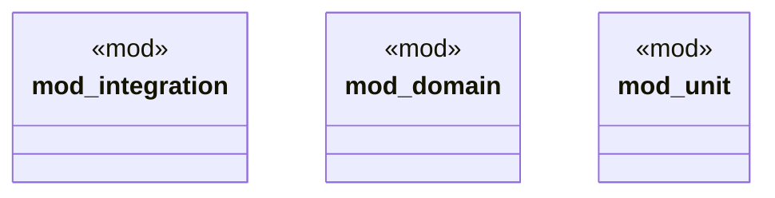

# `tests/v3-refactor/pre_refactor/mod.rs`

Source SHA-256: `4c8529ce1206b78204186f621577883214f5a97f5cb289e2299ef3040beea5b7`

## Dependencies

- None observed.

## Standing

- Structural parse: `ALIVE`
- Runtime behavior: `UNKNOWN`
