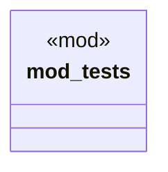

# `tests/validate_marketplace_rdf.rs`

Source SHA-256: `c4f5d139492e8b5f7bdd8d8c6eb75a3dc0e11583877f25fae74070b2a9447d01`

## Dependencies

- `ggen_core::Graph`
- `std::path::Path`

## Standing

- Structural parse: `ALIVE`
- Runtime behavior: `UNKNOWN`
