# `tests/validation_framework.rs`

Source SHA-256: `834a9f74bc6cd9bdbabd2a6c562cd8064db555b599f667729fc01645db086979`

```mermaid
classDiagram
    class struct_QualityScore {
      <<struct>>
      +"total: f32"
      +"dimensions: HashMap~String"
      +"feedback: Vec~String~"
      +"metadata: TestMetadata"
    }
    class struct_DimensionScore {
      <<struct>>
      +"score: f32"
      +"weight: f32"
      +"description: String"
      +"issues: Vec~String~"
      +"suggestions: Vec~String~"
    }
    class struct_TestMetadata {
      <<struct>>
      +"command: String"
      +"scenario: String"
      +"timestamp: String"
      +"model: String"
      +"execution_time_ms: u64"
    }
    class struct_UserScenario {
      <<struct>>
      +"name: String"
      +"description: String"
      +"command: String"
      +"args: Vec~String~"
      +"expected_behavior: ExpectedBehavior"
    }
    class struct_ExpectedBehavior {
      <<struct>>
      +"min_length: usize"
      +"max_length: usize"
      +"required_patterns: Vec~String~"
      +"forbidden_patterns: Vec~String~"
      +"quality_criteria: Vec~QualityCriterion~"
    }
    class struct_QualityCriterion {
      <<struct>>
      +"name: String"
      +"description: String"
      +"weight: f32"
      +"validator: fn(&str) -~ (f32"
    }
    class struct_ValidationFramework {
      <<struct>>
      +"scenarios: Vec~UserScenario~"
    }
    class fn_validate_structure {
      <<fn>>
    }
    class fn_validate_completeness {
      <<fn>>
    }
    class fn_validate_usability {
      <<fn>>
    }
    class fn_validate_clarity {
      <<fn>>
    }
    class fn_validate_sparql_syntax {
      <<fn>>
    }
    class fn_validate_query_efficiency {
      <<fn>>
    }
    class fn_validate_readability {
      <<fn>>
    }
    class fn_validate_seo {
      <<fn>>
    }
    class fn_validate_frontmatter_completeness {
      <<fn>>
    }
    class fn_validate_yaml {
      <<fn>>
    }
    class fn_validate_ontology {
      <<fn>>
    }
    class fn_validate_examples {
      <<fn>>
    }
    class fn_validate_turtle {
      <<fn>>
    }
    class mod_tests {
      <<mod>>
    }
    note "Default for ValidationFramework"
    note "ValidationFramework"
```

## Dependencies

- `serde::{Deserialize, Serialize}`
- `std::collections::HashMap`
- `super::*`

## Standing

- Structural parse: `ALIVE`
- Runtime behavior: `UNKNOWN`
