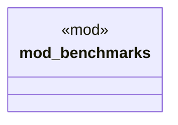

# `tests/vision_2030_benchmarks.rs`

Source SHA-256: `0a97ab4e16fb3d1a9c1506b7be868f5d059f5f91ac6ae284b189ca4ec1263016`

## Dependencies

- `std::time::Instant`

## Standing

- Structural parse: `ALIVE`
- Runtime behavior: `UNKNOWN`
