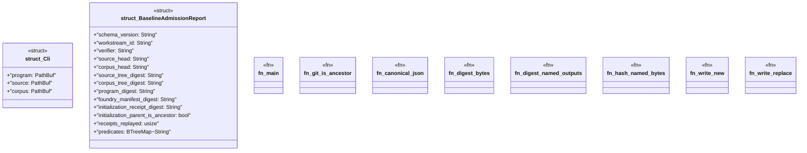

# `tools/architecture-foundry/src/bin/admit_baseline.rs`

Source SHA-256: `ef14ab17dff68779bb2a8e336c9771c58d06b7aa8b5c45731c8e935b0ac1bb17`

## Dependencies

- `anyhow::{bail, Context, Result}`
- `blake3::Hasher`
- `clap::Parser`
- `ggen_architecture_foundry::{ digest_file, load_program, replay_all_receipts, snapshot_repository, validate_program, FoundryManifest, Receipt, WorkstreamStateFile, CORPUS_SCHEMA, RECEIPT_SCHEMA, }`
- `serde::Serialize`
- `serde_yaml::Value as YamlValue`
- `std::collections::BTreeMap`
- `std::fs`
- `std::path::{Path, PathBuf}`
- `std::process::Command`

## Standing

- Structural parse: `ALIVE`
- Runtime behavior: `UNKNOWN`
