# `tools/architecture-foundry/src/bin/admit_capabilities.rs`

Source SHA-256: `9126744f82227999fd7d9f807020029ce68a969ded470922d6b1b6d2adc0b960`

```mermaid
classDiagram
    class struct_Cli {
      <<struct>>
      +"program: PathBuf"
      +"source: PathBuf"
      +"corpus: PathBuf"
    }
    class struct_CapabilityRecord {
      <<struct>>
      +"capability_id: String"
      +"subject: String"
      +"historical_source_commit: String"
      +"legacy_source_path: String"
      +"owning_subsystem: String"
      +"historical_semantic_owner: String"
      +"replacement_owner: String"
      +"admitted_owner: String"
      +"disposition: String"
      +"input_contract: String"
      +"output_contract: String"
      +"error_contract: String"
      +"side_effects: String"
      +"ordering_requirements: String"
      +"default_behavior: String"
      +"configuration_dependencies: String"
      +"evidence_fixtures: String"
      +"migration_path: String"
      +"rollback_path: String"
      +"archive_path: String"
      +"refusal_code: String"
      +"refusal_rationale: String"
    }
    class struct_ProvenanceRecord {
      <<struct>>
      +"capability_id: String"
      +"historical_source_commit: String"
      +"legacy_source_path: String"
      +"evidence_path: String"
      +"evidence_digest: String"
    }
    class struct_OwnershipRecord {
      <<struct>>
      +"capability_id: String"
      +"subsystem: String"
      +"historical_owner: String"
      +"replacement_owner: String"
      +"admitted_owner: String"
      +"ownership_basis: String"
    }
    class struct_DispositionObligation {
      <<struct>>
      +"capability_id: String"
      +"disposition: String"
      +"destination_required: bool"
      +"equivalence_required: bool"
      +"refusal_evidence_required: bool"
      +"recovery_required: bool"
    }
    class struct_Catalog {
      <<struct>>
      +"schema_version: String"
      +"evidence_digest: String"
      +"entries: Vec~T~"
    }
    class struct_CapabilityAdmissionReport {
      <<struct>>
      +"schema_version: String"
      +"workstream_id: String"
      +"verifier: String"
      +"source_head: String"
      +"corpus_head: String"
      +"capability_count: usize"
      +"provenance_count: usize"
      +"ownership_count: usize"
      +"obligation_count: usize"
      +"unknown_capabilities: usize"
      +"capabilities_without_provenance: usize"
      +"contradictory_owners: usize"
      +"disposition_counts: BTreeMap~String"
      +"subsystem_counts: BTreeMap~String"
      +"predicates: BTreeMap~String"
      +"evidence_digest: String"
    }
    class fn_main {
      <<fn>>
    }
    class fn_parse_capabilities {
      <<fn>>
    }
    class fn_build_record {
      <<fn>>
    }
    class fn_derive_owner {
      <<fn>>
    }
    class fn_ownership_basis {
      <<fn>>
    }
    class fn_required {
      <<fn>>
    }
    class fn_optional {
      <<fn>>
    }
    class fn_require_clean {
      <<fn>>
    }
    class fn_require_admitted {
      <<fn>>
    }
    class fn_require_ready {
      <<fn>>
    }
    class fn_canonical_json {
      <<fn>>
    }
    class fn_digest_bytes {
      <<fn>>
    }
    class fn_digest_named_outputs {
      <<fn>>
    }
    class fn_hash_named_bytes {
      <<fn>>
    }
    class fn_write_new {
      <<fn>>
    }
    class fn_write_replace {
      <<fn>>
    }
```

## Dependencies

- `anyhow::{bail, Context, Result}`
- `blake3::Hasher`
- `clap::Parser`
- `ggen_architecture_foundry::{ load_program, replay_all_receipts, snapshot_repository, validate_program, Receipt, WorkstreamStateFile, RECEIPT_SCHEMA, }`
- `serde::Serialize`
- `serde_yaml::Value as YamlValue`
- `std::collections::{BTreeMap, BTreeSet}`
- `std::fs`
- `std::path::{Path, PathBuf}`

## Standing

- Structural parse: `ALIVE`
- Runtime behavior: `UNKNOWN`
