# `tools/architecture-foundry/src/bin/admit_classification.rs`

Source SHA-256: `448ac48c7e6869a2f3622e04348e1991a7da8ed09920839148eb066101d1114e`

```mermaid
classDiagram
    class struct_Cli {
      <<struct>>
      +"program: PathBuf"
      +"source: PathBuf"
      +"corpus: PathBuf"
    }
    class struct_CapabilityCatalog {
      <<struct>>
      +"entries: Vec~CapabilityRecord~"
    }
    class struct_CapabilityRecord {
      <<struct>>
      +"capability_id: String"
      +"historical_source_commit: String"
      +"legacy_source_path: String"
      +"owning_subsystem: String"
      +"historical_semantic_owner: String"
      +"replacement_owner: String"
      +"admitted_owner: String"
      +"disposition: String"
      +"migration_path: String"
      +"rollback_path: String"
      +"archive_path: String"
      +"refusal_code: String"
      +"refusal_rationale: String"
    }
    class struct_ClassificationRecord {
      <<struct>>
      +"capability_id: String"
      +"classification: String"
      +"kernel_owner: String"
      +"corpus_destination: String"
      +"source_retirement_allowed: bool"
      +"classification_basis: String"
    }
    class struct_MigrationDependency {
      <<struct>>
      +"capability_id: String"
      +"predecessor_capabilities: Vec~String~"
      +"required_destination: String"
      +"destination_admission_required: bool"
      +"equivalence_required: bool"
      +"recovery_required: bool"
    }
    class struct_RecoveryPlan {
      <<struct>>
      +"capability_id: String"
      +"historical_source_commit: String"
      +"legacy_source_path: String"
      +"archive_path: String"
      +"rollback_path: String"
      +"recovery_command: String"
      +"recovery_evidence_required: bool"
    }
    class struct_Catalog {
      <<struct>>
      +"schema_version: String"
      +"source_catalog_digest: String"
      +"entries: Vec~T~"
    }
    class struct_ClassificationAdmissionReport {
      <<struct>>
      +"schema_version: String"
      +"workstream_id: String"
      +"verifier: String"
      +"source_head: String"
      +"corpus_head: String"
      +"component_count: usize"
      +"unclassified_components: usize"
      +"classification_conflicts: usize"
      +"migration_dependencies_closed: bool"
      +"classification_counts: BTreeMap~String"
      +"predicates: BTreeMap~String"
      +"source_catalog_digest: String"
    }
    class fn_main {
      <<fn>>
    }
    class fn_classify {
      <<fn>>
    }
    class fn_recovery_command {
      <<fn>>
    }
    class fn_sanitize_segment {
      <<fn>>
    }
    class fn_require_clean {
      <<fn>>
    }
    class fn_require_admitted {
      <<fn>>
    }
    class fn_require_ready {
      <<fn>>
    }
    class fn_canonical_json {
      <<fn>>
    }
    class fn_digest_bytes {
      <<fn>>
    }
    class fn_digest_named_outputs {
      <<fn>>
    }
    class fn_hash_named_bytes {
      <<fn>>
    }
    class fn_write_new {
      <<fn>>
    }
    class fn_write_replace {
      <<fn>>
    }
```

## Dependencies

- `anyhow::{bail, Context, Result}`
- `blake3::Hasher`
- `clap::Parser`
- `ggen_architecture_foundry::{ load_program, replay_all_receipts, snapshot_repository, validate_program, Receipt, WorkstreamStateFile, RECEIPT_SCHEMA, }`
- `serde::{Deserialize, Serialize}`
- `serde_yaml::Value as YamlValue`
- `std::collections::{BTreeMap, BTreeSet}`
- `std::fs`
- `std::path::{Path, PathBuf}`

## Standing

- Structural parse: `ALIVE`
- Runtime behavior: `UNKNOWN`
