# `tools/architecture-foundry/src/bin/admit_clean_room.rs`

Source SHA-256: `baccbd2d1a3885048edcf421d241475e318005a429411593a548057f4eff6090`

```mermaid
classDiagram
    class struct_Cli {
      <<struct>>
      +"program: PathBuf"
      +"source: PathBuf"
      +"corpus: PathBuf"
    }
    class struct_CleanRoomRun {
      <<struct>>
      +"run: u8"
      +"source_head: String"
      +"corpus_head: String"
      +"runtime_tests_passed: bool"
      +"receipts_replayed: usize"
      +"verification_valid: bool"
      +"verification_digest: String"
      +"foundry_tree_digest: String"
      +"clean_after_run: bool"
    }
    class struct_CleanRoomAdmissionReport {
      <<struct>>
      +"schema_version: String"
      +"workstream_id: String"
      +"verifier: String"
      +"source_head: String"
      +"corpus_head: String"
      +"runs: Vec~CleanRoomRun~"
      +"clean_room_build_success: bool"
      +"clean_room_verification_success: bool"
      +"replay_differences: usize"
      +"generated_drift: usize"
      +"second_run_semantic_result: String"
      +"predicates: BTreeMap~String"
      +"metrics: BTreeMap~String"
    }
    class fn_main {
      <<fn>>
    }
    class fn_execute_clean_run {
      <<fn>>
    }
    class fn_semantic_verification_digest {
      <<fn>>
    }
    class fn_normalize_verification_paths {
      <<fn>>
    }
    class fn_git_clone {
      <<fn>>
    }
    class fn_git_checkout {
      <<fn>>
    }
    class fn_digest_tree {
      <<fn>>
    }
    class fn_read_json {
      <<fn>>
    }
    class fn_require_clean {
      <<fn>>
    }
    class fn_require_admitted {
      <<fn>>
    }
    class fn_require_ready {
      <<fn>>
    }
    class fn_canonical_json {
      <<fn>>
    }
    class fn_digest_bytes {
      <<fn>>
    }
    class fn_digest_named_outputs {
      <<fn>>
    }
    class fn_hash_named_bytes {
      <<fn>>
    }
    class fn_write_new {
      <<fn>>
    }
    class fn_write_replace {
      <<fn>>
    }
```

## Dependencies

- `anyhow::{bail, Context, Result}`
- `blake3::Hasher`
- `clap::Parser`
- `ggen_architecture_foundry::{ load_program, replay_all_receipts, snapshot_repository, validate_program, verify_corpus, Receipt, VerificationReport, WorkstreamStateFile, RECEIPT_SCHEMA, }`
- `serde::Serialize`
- `serde_json::{json, Value as JsonValue}`
- `serde_yaml::Value as YamlValue`
- `std::collections::BTreeMap`
- `std::fs`
- `std::path::{Path, PathBuf}`
- `std::process::Command`
- `std::time::{SystemTime, UNIX_EPOCH}`
- `walkdir::WalkDir`

## Standing

- Structural parse: `ALIVE`
- Runtime behavior: `UNKNOWN`
