# `tools/architecture-foundry/src/bin/admit_extraction.rs`

Source SHA-256: `6f2e3ea832da8b2c22ceb1fb87f19b1965376cca12dab6899b4b70e14357429c`

```mermaid
classDiagram
    class struct_Cli {
      <<struct>>
      +"program: PathBuf"
      +"source: PathBuf"
      +"corpus: PathBuf"
    }
    class struct_CapabilityCatalog {
      <<struct>>
      +"entries: Vec~CapabilityRecord~"
    }
    class struct_CapabilityRecord {
      <<struct>>
      +"capability_id: String"
      +"subject: String"
      +"historical_source_commit: String"
      +"legacy_source_path: String"
      +"owning_subsystem: String"
      +"historical_semantic_owner: String"
      +"replacement_owner: String"
      +"admitted_owner: String"
      +"disposition: String"
      +"input_contract: String"
      +"output_contract: String"
      +"error_contract: String"
      +"side_effects: String"
      +"ordering_requirements: String"
      +"default_behavior: String"
      +"configuration_dependencies: String"
      +"evidence_fixtures: String"
      +"migration_path: String"
      +"rollback_path: String"
      +"archive_path: String"
      +"refusal_code: String"
      +"refusal_rationale: String"
    }
    class struct_ClassificationCatalog {
      <<struct>>
      +"entries: Vec~ClassificationRecord~"
    }
    class struct_ClassificationRecord {
      <<struct>>
      +"capability_id: String"
      +"classification: String"
      +"kernel_owner: String"
      +"corpus_destination: String"
      +"source_retirement_allowed: bool"
      +"classification_basis: String"
    }
    class struct_ComponentSourceFile {
      <<struct>>
      +"git_path: String"
      +"git_object_id: String"
      +"git_mode: String"
      +"byte_length: usize"
      +"blake3: String"
      +"blob_path: String"
    }
    class struct_ComponentManifest {
      <<struct>>
      +"schema_version: String"
      +"capability_id: String"
      +"source_repository: String"
      +"corpus_repository: String"
      +"source_head: String"
      +"corpus_parent_head: String"
      +"historical_commit: String"
      +"requested_source_path: String"
      +"normalized_source_path: String"
      +"disposition: String"
      +"classification: String"
      +"kernel_owner: String"
      +"corpus_destination: String"
      +"resolution: String"
      +"source_files: Vec~ComponentSourceFile~"
      +"semantic_evidence_path: String"
      +"semantic_evidence_digest: String"
      +"source_removed: bool"
      +"recovery_command: String"
    }
    class struct_LineageRecord {
      <<struct>>
      +"schema_version: String"
      +"capability_id: String"
      +"source_repository: String"
      +"corpus_repository: String"
      +"source_head: String"
      +"corpus_parent_head: String"
      +"historical_commit: String"
      +"source_path: String"
      +"destination_path: String"
      +"manifest_digest: String"
      +"blob_digests: Vec~String~"
      +"disposition: String"
      +"classification: String"
      +"source_removed: bool"
    }
    class struct_ExtractionLedger {
      <<struct>>
      +"schema_version: String"
      +"source_head: String"
      +"corpus_parent_head: String"
      +"component_count: usize"
      +"recovered_source_components: usize"
      +"semantic_evidence_only_components: usize"
      +"unique_blob_count: usize"
      +"total_source_files: usize"
      +"components: Vec~ComponentManifest~"
    }
    class struct_ExtractionAdmissionReport {
      <<struct>>
      +"schema_version: String"
      +"workstream_id: String"
      +"verifier: String"
      +"source_head: String"
      +"corpus_head: String"
      +"extracted_components: usize"
      +"extracted_components_without_lineage: usize"
      +"unresolved_required_sources: usize"
      +"unique_blob_count: usize"
      +"total_source_files: usize"
      +"source_removed_before_destination_admission: bool"
      +"source_and_destination_heads_bound: bool"
      +"cross_repository_receipts_valid: bool"
      +"predicates: BTreeMap~String"
    }
    class struct_GitTreeEntry {
      <<struct>>
      +"mode: String"
      +"object_id: String"
      +"path: String"
    }
    class fn_main {
      <<fn>>
    }
    class fn_resolve_commit {
      <<fn>>
    }
    class fn_normalize_legacy_path {
      <<fn>>
    }
    class fn_resolve_tree_entries {
      <<fn>>
    }
    class fn_git_ls_tree {
      <<fn>>
    }
    class fn_git_cat_file {
      <<fn>>
    }
    class fn_git_text {
      <<fn>>
    }
    class fn_glob_matches {
      <<fn>>
    }
    class fn_recovery_command {
      <<fn>>
    }
    class fn_safe_relative {
      <<fn>>
    }
    class fn_safe_name {
      <<fn>>
    }
    class fn_verify_existing {
      <<fn>>
    }
    class fn_require_clean {
      <<fn>>
    }
    class fn_require_admitted {
      <<fn>>
    }
    class fn_require_ready {
      <<fn>>
    }
    class fn_canonical_json {
      <<fn>>
    }
    class fn_digest_bytes {
      <<fn>>
    }
    class fn_digest_named_outputs {
      <<fn>>
    }
    class fn_hash_named_bytes {
      <<fn>>
    }
    class fn_write_new {
      <<fn>>
    }
    class fn_write_replace {
      <<fn>>
    }
```

## Dependencies

- `anyhow::{bail, Context, Result}`
- `blake3::Hasher`
- `clap::Parser`
- `ggen_architecture_foundry::{ load_program, replay_all_receipts, snapshot_repository, validate_program, Receipt, WorkstreamStateFile, RECEIPT_SCHEMA, }`
- `serde::{Deserialize, Serialize}`
- `serde_yaml::Value as YamlValue`
- `std::collections::{BTreeMap, BTreeSet}`
- `std::fs`
- `std::path::{Component, Path, PathBuf}`
- `std::process::Command`

## Standing

- Structural parse: `ALIVE`
- Runtime behavior: `UNKNOWN`
