# `tools/architecture-foundry/src/bin/admit_final.rs`

Source SHA-256: `843ce1df366df4c0363fc4500984c87aa9c8feb7bf6b26f5cf026664de8eedc8`

```mermaid
classDiagram
    class struct_Cli {
      <<struct>>
      +"program: PathBuf"
      +"source: PathBuf"
      +"corpus: PathBuf"
    }
    class struct_Catalog {
      <<struct>>
      +"entries: Vec~T~"
    }
    class struct_CapabilityRecord {
      <<struct>>
      +"disposition: String"
    }
    class struct_EquivalenceCase {
      <<struct>>
      +"positive_witness: bool"
      +"negative_falsifier: bool"
      +"verifier: String"
    }
    class fn_main {
      <<fn>>
    }
    class fn_digest_file {
      <<fn>>
    }
    class fn_read_json {
      <<fn>>
    }
    class fn_require_clean {
      <<fn>>
    }
    class fn_canonical_json {
      <<fn>>
    }
    class fn_digest_bytes {
      <<fn>>
    }
    class fn_digest_named_outputs {
      <<fn>>
    }
    class fn_hash_named_bytes {
      <<fn>>
    }
    class fn_write_new {
      <<fn>>
    }
    class fn_write_replace {
      <<fn>>
    }
```

## Dependencies

- `anyhow::{bail, Context, Result}`
- `blake3::Hasher`
- `clap::Parser`
- `ggen_architecture_foundry::{ load_program, replay_all_receipts, snapshot_repository, validate_program, EvidenceFile, FinalEvidenceReport, Receipt, StandingRecord, WorkstreamStateFile, CORPUS_SCHEMA, FINAL_EVIDENCE_SCHEMA, RECEIPT_SCHEMA, }`
- `serde::Deserialize`
- `serde_json::{json, Value as JsonValue}`
- `std::collections::BTreeMap`
- `std::fs`
- `std::path::{Path, PathBuf}`

## Standing

- Structural parse: `ALIVE`
- Runtime behavior: `UNKNOWN`
