# `tools/architecture-foundry/src/bin/admit_observation.rs`

Source SHA-256: `1f48e955797e9234d7bec68d2819887a4cca8ef3d1c03717cafb648b51b76e4c`

```mermaid
classDiagram
    class struct_Cli {
      <<struct>>
      +"program: PathBuf"
      +"source: PathBuf"
      +"corpus: PathBuf"
      +"evidence_ref: String"
    }
    class struct_ObserverClassRecord {
      <<struct>>
      +"class_id: u8"
      +"observer_class: String"
      +"raw_row: String"
      +"attempted: bool"
    }
    class struct_CapabilityCandidate {
      <<struct>>
      +"capability_id: String"
      +"evidence_commit: String"
      +"evidence_path: String"
    }
    class struct_ObservationAdmissionReport {
      <<struct>>
      +"schema_version: String"
      +"workstream_id: String"
      +"verifier: String"
      +"source_head: String"
      +"corpus_head: String"
      +"evidence_ref: String"
      +"evidence_commit: String"
      +"capability_count: usize"
      +"observer_class_count: usize"
      +"observer_classes_unattempted: usize"
      +"orphan_candidates: usize"
      +"inventory_complete: bool"
      +"predicates: BTreeMap~String"
      +"evidence_digests: BTreeMap~String"
    }
    class struct_ObserverClassCatalog {
      <<struct>>
      +"schema_version: String"
      +"evidence_commit: String"
      +"records: Vec~ObserverClassRecord~"
    }
    class struct_CapabilityCandidateCatalog {
      <<struct>>
      +"schema_version: String"
      +"evidence_commit: String"
      +"candidates: Vec~CapabilityCandidate~"
    }
    class struct_ExclusionCatalog {
      <<struct>>
      +"schema_version: String"
      +"evidence_commit: String"
      +"observer_classes: Vec~ObserverClassRecord~"
    }
    class fn_main {
      <<fn>>
    }
    class fn_parse_capability_ids {
      <<fn>>
    }
```

## Dependencies

- `anyhow::{bail, Context, Result}`
- `blake3::Hasher`
- `clap::Parser`
- `ggen_architecture_foundry::{ digest_file, load_program, replay_all_receipts, snapshot_repository, validate_program, Receipt, WorkstreamStateFile, RECEIPT_SCHEMA, }`
- `serde::Serialize`
- `serde_yaml::Value as YamlValue`
- `std::collections::{BTreeMap, BTreeSet}`
- `std::fs`
- `std::path::{Path, PathBuf}`
- `std::process::Command`

## Standing

- Structural parse: `ALIVE`
- Runtime behavior: `UNKNOWN`
