# `tools/architecture-foundry/src/bin/admit_products.rs`

Source SHA-256: `2c425916933a9743f86410155c04d524fdae14f67f3087a1ae508021e3144fc7`

```mermaid
classDiagram
    class struct_Cli {
      <<struct>>
      +"program: PathBuf"
      +"source: PathBuf"
      +"corpus: PathBuf"
      +"stage: Stage"
    }
    class enum_Stage {
      <<enum>>
    }
    class struct_Catalog {
      <<struct>>
      +"entries: Vec~T~"
    }
    class struct_CapabilityRecord {
      <<struct>>
      +"capability_id: String"
      +"owning_subsystem: String"
      +"admitted_owner: String"
      +"disposition: String"
      +"input_contract: String"
      +"output_contract: String"
      +"error_contract: String"
      +"side_effects: String"
      +"ordering_requirements: String"
      +"default_behavior: String"
      +"configuration_dependencies: String"
      +"evidence_fixtures: String"
      +"refusal_code: String"
      +"refusal_rationale: String"
    }
    class struct_ClassificationRecord {
      <<struct>>
      +"capability_id: String"
      +"classification: String"
      +"corpus_destination: String"
    }
    class struct_ComponentManifest {
      <<struct>>
      +"capability_id: String"
      +"source_files: Vec~ComponentSourceFile~"
      +"semantic_evidence_digest: String"
      +"source_removed: bool"
    }
    class struct_ComponentSourceFile {
      <<struct>>
      +"blake3: String"
      +"blob_path: String"
    }
    class struct_PrimitiveRecord {
      <<struct>>
      +"primitive_id: String"
      +"subsystem: String"
      +"disposition_family: String"
      +"capability_ids: Vec~String~"
      +"authority_references: Vec~String~"
      +"implementation_references: Vec~String~"
      +"positive_witness_digest: String"
      +"negative_falsifier_code: String"
      +"verifier: String"
      +"receipt_reference: String"
    }
    class struct_PackRecord {
      <<struct>>
      +"pack_id: String"
      +"authority_reference: String"
      +"primitive_ids: Vec~String~"
      +"parameter_schema_path: String"
      +"verifier_entrypoint: String"
      +"replay_command: String"
      +"operating_model: JsonValue"
      +"cost_model: JsonValue"
      +"capacity_model: JsonValue"
      +"negative_falsifier_code: String"
      +"receipt_reference: String"
    }
    class struct_EquivalenceCase {
      <<struct>>
      +"capability_id: String"
      +"case_type: String"
      +"positive_witness: bool"
      +"negative_falsifier: bool"
      +"verifier: String"
      +"evidence_digests: Vec~String~"
      +"difference: String"
    }
    class struct_StageReport {
      <<struct>>
      +"schema_version: String"
      +"workstream_id: String"
      +"verifier: String"
      +"source_head: String"
      +"corpus_head: String"
      +"item_count: usize"
      +"failure_count: usize"
      +"negative_falsifiers_passed: usize"
      +"predicates: BTreeMap~String"
      +"metrics: BTreeMap~String"
    }
    class struct_ContextState {
      <<struct>>
      +"program: WorkProgram"
      +"program_digest: String"
      +"source: ggen_architecture_foundry::RepositorySnapshot"
      +"corpus: ggen_architecture_foundry::RepositorySnapshot"
      +"foundry_root: PathBuf"
      +"state_path: PathBuf"
      +"state: WorkstreamStateFile"
    }
    class fn_main {
      <<fn>>
    }
    class fn_load_context {
      <<fn>>
    }
    class fn_admit_primitives {
      <<fn>>
    }
    class fn_admit_packs {
      <<fn>>
    }
    class fn_admit_equivalence {
      <<fn>>
    }
    class fn_finish_stage {
      <<fn>>
    }
    class fn_stage_report {
      <<fn>>
    }
    class fn_require_stage {
      <<fn>>
    }
    class fn_pack_accepts {
      <<fn>>
    }
    class fn_count_domains {
      <<fn>>
    }
    class fn_read_json {
      <<fn>>
    }
    class fn_relative_to {
      <<fn>>
    }
    class fn_corrupt_digest {
      <<fn>>
    }
    class fn_safe_name {
      <<fn>>
    }
    class fn_require_clean {
      <<fn>>
    }
    class fn_canonical_json {
      <<fn>>
    }
    class fn_digest_bytes {
      <<fn>>
    }
    class fn_digest_named_outputs {
      <<fn>>
    }
    class fn_hash_named_bytes {
      <<fn>>
    }
    class fn_write_new {
      <<fn>>
    }
    class fn_write_replace {
      <<fn>>
    }
```

## Dependencies

- `anyhow::{bail, Context, Result}`
- `blake3::Hasher`
- `clap::{Parser, Subcommand}`
- `ggen_architecture_foundry::{ load_program, replay_all_receipts, snapshot_repository, validate_program, Receipt, WorkProgram, WorkstreamStateFile, RECEIPT_SCHEMA, }`
- `serde::{Deserialize, Serialize}`
- `serde_json::{json, Value as JsonValue}`
- `serde_yaml::Value as YamlValue`
- `std::collections::{BTreeMap, BTreeSet}`
- `std::fs`
- `std::path::{Path, PathBuf}`

## Standing

- Structural parse: `ALIVE`
- Runtime behavior: `UNKNOWN`
