# `tools/architecture-foundry/src/bin/admit_reference.rs`

Source SHA-256: `7838967287b410097b45184c2a8223c76035b94ff008fd32a444d4696feacdf5`

```mermaid
classDiagram
    class struct_Cli {
      <<struct>>
      +"program: PathBuf"
      +"source: PathBuf"
      +"corpus: PathBuf"
    }
    class struct_Catalog {
      <<struct>>
      +"entries: Vec~T~"
    }
    class struct_PackRecord {
      <<struct>>
      +"pack_id: String"
      +"authority_reference: String"
      +"primitive_ids: Vec~String~"
      +"parameter_schema_path: String"
      +"verifier_entrypoint: String"
      +"replay_command: String"
      +"operating_model: JsonValue"
      +"cost_model: JsonValue"
      +"capacity_model: JsonValue"
      +"negative_falsifier_code: String"
      +"receipt_reference: String"
    }
    class struct_PrimitiveRecord {
      <<struct>>
      +"primitive_id: String"
    }
    class struct_BuildRun {
      <<struct>>
      +"run: u8"
      +"exit_code: i32"
      +"stdout_digest: String"
      +"stderr_digest: String"
      +"output_tree_digest: String"
      +"success: bool"
    }
    class struct_ReferenceAdmissionReport {
      <<struct>>
      +"schema_version: String"
      +"workstream_id: String"
      +"verifier: String"
      +"source_head: String"
      +"corpus_head: String"
      +"reference_id: String"
      +"pack_id: String"
      +"primitive_count: usize"
      +"build_runs: Vec~BuildRun~"
      +"reference_build_success: bool"
      +"verification_success: bool"
      +"replay_match: bool"
      +"solution_admission: bool"
      +"predicates: BTreeMap~String"
      +"metrics: BTreeMap~String"
    }
    class fn_main {
      <<fn>>
    }
    class fn_manufacture_reference {
      <<fn>>
    }
    class fn_run_reference_tests {
      <<fn>>
    }
    class fn_build_run {
      <<fn>>
    }
    class fn_verify_reference {
      <<fn>>
    }
    class fn_digest_tree {
      <<fn>>
    }
    class fn_sorted_files {
      <<fn>>
    }
    class fn_read_json {
      <<fn>>
    }
    class fn_require_clean {
      <<fn>>
    }
    class fn_require_admitted {
      <<fn>>
    }
    class fn_require_ready {
      <<fn>>
    }
    class fn_canonical_json {
      <<fn>>
    }
    class fn_digest_bytes {
      <<fn>>
    }
    class fn_digest_named_outputs {
      <<fn>>
    }
    class fn_hash_named_bytes {
      <<fn>>
    }
    class fn_write_new {
      <<fn>>
    }
    class fn_write_replace {
      <<fn>>
    }
```

## Dependencies

- `anyhow::{bail, Context, Result}`
- `blake3::Hasher`
- `clap::Parser`
- `ggen_architecture_foundry::{ load_program, replay_all_receipts, snapshot_repository, validate_program, Receipt, WorkstreamStateFile, RECEIPT_SCHEMA, }`
- `serde::{Deserialize, Serialize}`
- `serde_json::{json, Value as JsonValue}`
- `serde_yaml::Value as YamlValue`
- `std::collections::{BTreeMap, BTreeSet}`
- `std::fs`
- `std::path::{Path, PathBuf}`
- `std::process::{Command, Output}`
- `std::time::{SystemTime, UNIX_EPOCH}`
- `walkdir::WalkDir`

## Standing

- Structural parse: `ALIVE`
- Runtime behavior: `UNKNOWN`
