# `tools/architecture-foundry/src/bin/admit_verification.rs`

Source SHA-256: `5f5117413ce89a5253cae684db451d5a26207bca35f5d5e2eb65b752aeee1c6d`

```mermaid
classDiagram
    class struct_Cli {
      <<struct>>
      +"program: PathBuf"
      +"source: PathBuf"
      +"corpus: PathBuf"
    }
    class struct_Catalog {
      <<struct>>
      +"entries: Vec~T~"
    }
    class struct_CapabilityRecord {
      <<struct>>
      +"capability_id: String"
      +"owning_subsystem: String"
      +"disposition: String"
    }
    class struct_EquivalenceCase {
      <<struct>>
      +"capability_id: String"
      +"positive_witness: bool"
      +"negative_falsifier: bool"
      +"verifier: String"
    }
    class struct_SubsystemStanding {
      <<struct>>
      +"subsystem: String"
      +"capability_count: usize"
      +"system_evidence_count: usize"
      +"equivalence_case_count: usize"
      +"positive_witnesses: usize"
      +"negative_falsifiers: usize"
      +"assigned_verifiers: usize"
      +"unknown_dispositions: usize"
      +"evidence_basis: Vec~String~"
      +"standing: String"
    }
    class struct_SabotageCase {
      <<struct>>
      +"case_id: String"
      +"target_receipt: String"
      +"injected_fault: String"
      +"refused: bool"
      +"refusal_code: String"
    }
    class struct_VerificationAdmissionReport {
      <<struct>>
      +"schema_version: String"
      +"workstream_id: String"
      +"verifier: String"
      +"source_head: String"
      +"corpus_head: String"
      +"receipts_replayed: usize"
      +"subsystem_count: usize"
      +"subsystems_alive: usize"
      +"unknown_standings: usize"
      +"unassigned_verifiers: usize"
      +"sabotage_case_count: usize"
      +"sabotage_cases_all_refused: bool"
      +"external_verifier_passes: bool"
      +"predicates: BTreeMap~String"
      +"metrics: BTreeMap~String"
    }
    class fn_main {
      <<fn>>
    }
    class struct_SystemEvidence {
      <<struct>>
      +"verifier: String"
      +"basis: String"
    }
    class fn_system_evidence {
      <<fn>>
    }
    class fn_run_sabotage {
      <<fn>>
    }
    class fn_verify_receipt {
      <<fn>>
    }
    class fn_read_json {
      <<fn>>
    }
    class fn_require_clean {
      <<fn>>
    }
    class fn_require_admitted {
      <<fn>>
    }
    class fn_require_ready {
      <<fn>>
    }
    class fn_corrupt_digest {
      <<fn>>
    }
    class fn_canonical_json {
      <<fn>>
    }
    class fn_digest_bytes {
      <<fn>>
    }
    class fn_digest_named_outputs {
      <<fn>>
    }
    class fn_hash_named_bytes {
      <<fn>>
    }
    class fn_write_new {
      <<fn>>
    }
    class fn_write_replace {
      <<fn>>
    }
```

## Dependencies

- `anyhow::{bail, Context, Result}`
- `blake3::Hasher`
- `clap::Parser`
- `ggen_architecture_foundry::{ load_program, replay_all_receipts, snapshot_repository, validate_program, Receipt, WorkstreamStateFile, RECEIPT_SCHEMA, }`
- `serde::{Deserialize, Serialize}`
- `serde_json::{json, Value as JsonValue}`
- `serde_yaml::Value as YamlValue`
- `std::collections::{BTreeMap, BTreeSet}`
- `std::fs`
- `std::path::{Path, PathBuf}`

## Standing

- Structural parse: `ALIVE`
- Runtime behavior: `UNKNOWN`
