# `tools/architecture-foundry/src/lib.rs`

Source SHA-256: `15eee44f8ae43610f9c7f7b6c393028422fb6a51511c90dc7615c2a058dc41ca`

```mermaid
classDiagram
    class enum_FoundryError {
      <<enum>>
    }
    class type_Result {
      <<type>>
    }
    class struct_WorkProgram {
      <<struct>>
      +"schema_version: String"
      +"program_id: String"
      +"program_name: String"
      +"source_repository: String"
      +"corpus_repository: String"
      +"manufacturing_kernel: String"
      +"status: String"
      +"constitutional_inputs: Vec~String~"
      +"invariants: Vec~String~"
      +"repositories: BTreeMap~String"
      +"workstreams: Vec~Workstream~"
      +"initial_solution_packs: Vec~String~"
      +"final_predicates: BTreeMap~String"
      +"hard_block_classes: Vec~String~"
      +"non_blocking_conditions: Vec~String~"
    }
    class struct_RepositoryDefinition {
      <<struct>>
      +"role: String"
      +"owns: Vec~String~"
    }
    class struct_Workstream {
      <<struct>>
      +"id: String"
      +"name: String"
      +"role: String"
      +"dependencies: Vec~String~"
      +"partition_key: Option~String~"
      +"outputs: Vec~String~"
      +"predicates: BTreeMap~String"
    }
    class struct_ProgramValidationReport {
      <<struct>>
      +"schema_version: String"
      +"program_id: String"
      +"program_digest: String"
      +"workstream_order: Vec~String~"
      +"invariant_count: usize"
      +"solution_pack_count: usize"
      +"valid: bool"
    }
    class struct_RepositorySnapshot {
      <<struct>>
      +"path: String"
      +"head: String"
      +"branch: String"
      +"origin: Option~String~"
      +"clean: bool"
      +"dirty_entries: Vec~String~"
      +"tracked_file_count: usize"
      +"tracked_tree_digest: String"
    }
    class struct_BaselineManifest {
      <<struct>>
      +"schema_version: String"
      +"program_id: String"
      +"program_digest: String"
      +"source: RepositorySnapshot"
      +"corpus: RepositorySnapshot"
    }
    class struct_Receipt {
      <<struct>>
      +"schema_version: String"
      +"receipt_type: String"
      +"subject: String"
      +"subject_digest: String"
      +"source_head: String"
      +"corpus_head: String"
      +"input_digests: BTreeMap~String"
      +"output_digests: BTreeMap~String"
      +"run_id: String"
    }
    class struct_FoundryManifest {
      <<struct>>
      +"schema_version: String"
      +"program_id: String"
      +"program_digest: String"
      +"source_repository: String"
      +"corpus_repository: String"
      +"source_head: String"
      +"corpus_parent_head: String"
      +"source_tree_digest: String"
      +"corpus_parent_tree_digest: String"
      +"initial_solution_packs: Vec~String~"
      +"catalog_paths: Vec~String~"
      +"workstream_ids: Vec~String~"
    }
    class struct_Catalog {
      <<struct>>
      +"schema_version: String"
      +"catalog_type: String"
      +"entries: Vec~T~"
    }
    class struct_SolutionPackRecord {
      <<struct>>
      +"id: String"
      +"standing: String"
      +"required_workstreams: Vec~String~"
    }
    class struct_WorkstreamStateFile {
      <<struct>>
      +"schema_version: String"
      +"program_id: String"
      +"workstreams: BTreeMap~String"
    }
    class struct_WorkstreamState {
      <<struct>>
      +"status: String"
      +"dependencies: Vec~String~"
      +"report_digest: Option~String~"
      +"receipt_path: Option~String~"
    }
    class struct_StandingRecord {
      <<struct>>
      +"schema_version: String"
      +"program_id: String"
      +"standing: String"
      +"admitted: bool"
      +"reasons: Vec~String~"
      +"source_head: String"
      +"corpus_head: String"
    }
    class struct_InitializationReport {
      <<struct>>
      +"manifest_path: String"
      +"receipt_path: String"
      +"generated_file_count: usize"
      +"generated_tree_digest: String"
      +"source_head: String"
      +"corpus_parent_head: String"
    }
    class struct_MigrationManifest {
      <<struct>>
      +"schema_version: String"
      +"batch_id: String"
      +"source_head: String"
      +"corpus_parent_head: String"
      +"components: Vec~ComponentMigration~"
    }
    class struct_ComponentMigration {
      <<struct>>
      +"id: String"
      +"source_path: String"
      +"destination_path: String"
      +"disposition: String"
      +"capability_ids: Vec~String~"
      +"replacement_owner: String"
      +"rationale: String"
    }
    class struct_LineageRecord {
      <<struct>>
      +"schema_version: String"
      +"batch_id: String"
      +"component_id: String"
      +"source_repository: String"
      +"corpus_repository: String"
      +"source_head: String"
      +"corpus_parent_head: String"
      +"source_path: String"
      +"destination_path: String"
      +"content_digest: String"
      +"disposition: String"
      +"capability_ids: Vec~String~"
      +"replacement_owner: String"
      +"rationale: String"
    }
    class struct_HistoricalExtractionLineageRecord {
      <<struct>>
      +"schema_version: String"
      +"capability_id: String"
      +"source_repository: String"
      +"corpus_repository: String"
      +"source_head: String"
      +"corpus_parent_head: String"
      +"historical_commit: String"
      +"historical_commits: Vec~String~"
      +"source_path: String"
      +"destination_path: String"
      +"manifest_digest: String"
      +"blob_digests: Vec~String~"
      +"disposition: String"
      +"classification: String"
      +"source_removed: bool"
    }
    class struct_HistoricalComponentManifest {
      <<struct>>
      +"schema_version: String"
      +"capability_id: String"
      +"source_repository: String"
      +"corpus_repository: String"
      +"source_head: String"
      +"corpus_parent_head: String"
      +"historical_commit: String"
      +"historical_commits: Vec~String~"
      +"requested_source_path: String"
      +"normalized_source_path: String"
      +"disposition: String"
      +"classification: String"
      +"kernel_owner: String"
      +"corpus_destination: String"
      +"resolution: String"
      +"source_files: Vec~HistoricalComponentSourceFile~"
      +"semantic_evidence_path: String"
      +"semantic_evidence_digest: String"
      +"source_removed: bool"
      +"recovery_command: String"
    }
    class struct_HistoricalComponentSourceFile {
      <<struct>>
      +"git_path: String"
      +"historical_commit: String"
      +"git_object_id: String"
      +"git_mode: String"
      +"byte_length: usize"
      +"blake3: String"
      +"blob_path: String"
    }
    class struct_ExtractionReport {
      <<struct>>
      +"batch_id: String"
      +"component_count: usize"
      +"source_head: String"
      +"corpus_parent_head: String"
      +"batch_digest: String"
      +"receipt_path: String"
    }
    class struct_EvidenceFile {
      <<struct>>
      +"repository: String"
      +"path: String"
      +"blake3: String"
    }
    class struct_WorkstreamReport {
      <<struct>>
      +"schema_version: String"
      +"workstream_id: String"
      +"source_head: String"
      +"corpus_head: String"
      +"verifier: String"
      +"outputs: Vec~EvidenceFile~"
      +"predicates: BTreeMap~String"
    }
    class struct_WorkstreamAdmission {
      <<struct>>
      +"workstream_id: String"
      +"report_digest: String"
      +"receipt_path: String"
      +"status: String"
    }
    class struct_FinalEvidenceReport {
      <<struct>>
      +"schema_version: String"
      +"source_head: String"
      +"corpus_head: String"
      +"verifier: String"
      +"predicates: BTreeMap~String"
      +"evidence: Vec~EvidenceFile~"
    }
    class struct_VerificationReport {
      <<struct>>
      +"program_valid: bool"
      +"source_head: String"
      +"corpus_head: String"
      +"manifest_valid: bool"
      +"lineage_records_checked: usize"
      +"invalid_lineage_records: Vec~String~"
      +"receipts_checked: usize"
      +"invalid_receipts: Vec~String~"
      +"admitted_workstreams: Vec~String~"
      +"standing: String"
      +"admitted: bool"
    }
    class fn_load_program {
      <<fn>>
    }
    class fn_validate_program {
      <<fn>>
    }
    class fn_snapshot_repository {
      <<fn>>
    }
    class fn_create_baseline {
      <<fn>>
    }
    class fn_initialize_corpus {
      <<fn>>
    }
    class fn_load_migration_manifest {
      <<fn>>
    }
    class fn_extract_components {
      <<fn>>
    }
    class fn_load_workstream_report {
      <<fn>>
    }
    class fn_admit_workstream {
      <<fn>>
    }
    class fn_load_final_evidence {
      <<fn>>
    }
    class fn_admit_solution {
      <<fn>>
    }
    class fn_verify_corpus {
      <<fn>>
    }
    class fn_replay_all_receipts {
      <<fn>>
    }
    class fn_validate_migration_manifest {
      <<fn>>
    }
    class fn_verify_lineage_record {
      <<fn>>
    }
    class fn_verify_current_lineage_record {
      <<fn>>
    }
    class fn_verify_historical_extraction_lineage {
      <<fn>>
    }
    class fn_historical_commit_set {
      <<fn>>
    }
    class fn_is_full_git_sha {
      <<fn>>
    }
    class fn_replay_receipt {
      <<fn>>
    }
    class fn_verify_evidence_file {
      <<fn>>
    }
    class fn_require_repository_role {
      <<fn>>
    }
    class fn_topological_order {
      <<fn>>
    }
    class fn_require_clean {
      <<fn>>
    }
    class fn_make_receipt {
      <<fn>>
    }
    class fn_safe_relative {
      <<fn>>
    }
    class fn_sorted_files {
      <<fn>>
    }
    class fn_digest_named_outputs {
      <<fn>>
    }
    class fn_hash_named_bytes {
      <<fn>>
    }
    class fn_digest_file {
      <<fn>>
    }
    class fn_digest_bytes {
      <<fn>>
    }
    class fn_digest_json {
      <<fn>>
    }
    class fn_read {
      <<fn>>
    }
    class fn_write_json {
      <<fn>>
    }
    class fn_write_json_replace {
      <<fn>>
    }
    class fn_write_bytes_exact {
      <<fn>>
    }
    class fn_git {
      <<fn>>
    }
    class fn_git_optional {
      <<fn>>
    }
    class fn_git_bytes {
      <<fn>>
    }
    class fn_refusal {
      <<fn>>
    }
```

## Dependencies

- `blake3::Hasher`
- `serde::{Deserialize, Serialize}`
- `serde_yaml::Value as YamlValue`
- `std::collections::{BTreeMap, BTreeSet}`
- `std::fs`
- `std::path::{Component, Path, PathBuf}`
- `std::process::Command`
- `thiserror::Error`
- `walkdir::WalkDir`

## Standing

- Structural parse: `ALIVE`
- Runtime behavior: `UNKNOWN`
