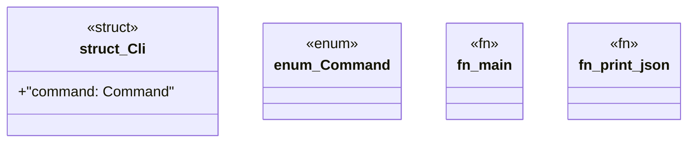

# `tools/architecture-foundry/src/main.rs`

Source SHA-256: `a05e8b69dc3f848f08de6f77cd41e5b8a8a3d795598e62d6549efdd561be4a75`

## Dependencies

- `clap::{Parser, Subcommand}`
- `ggen_architecture_foundry::{ admit_solution, admit_workstream, create_baseline, extract_components, initialize_corpus, load_final_evidence, load_migration_manifest, load_program, load_workstream_report, replay_all_receipts, validate_program, verify_corpus, }`
- `serde::Serialize`
- `std::path::PathBuf`

## Standing

- Structural parse: `ALIVE`
- Runtime behavior: `UNKNOWN`
